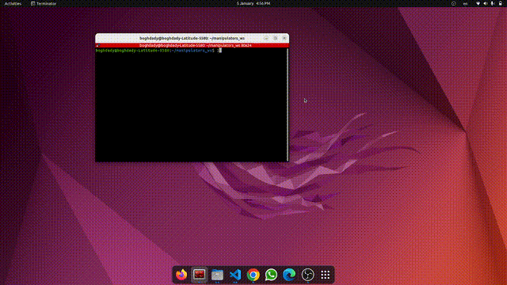
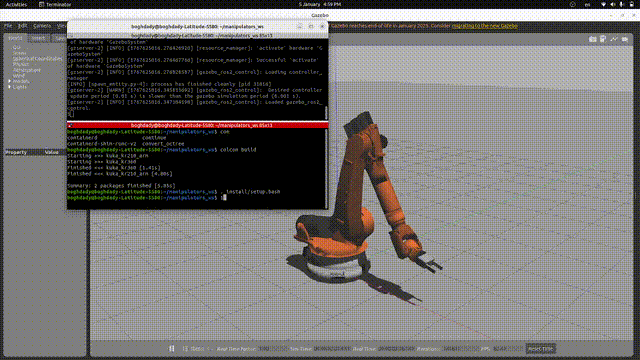

أنت الآن في المرحلة النهائية! كل ما عليك فعله هو نسخ الكود الموجود في **المربع الأسود** بالأسفل، ووضعه في ملف الـ `README.md` على حسابك في GitHub.

إليك الكود جاهزاً (قم بتحديده ونسخه بالكامل):

```markdown
# KUKA KR210 Industrial Manipulator - Full ROS 2 Control & Kinematics Pipeline 🦾🤖

 


A comprehensive robotics project featuring the end-to-end development of the **KUKA KR210** industrial arm. This repository demonstrates expertise in robot modeling, physical simulation, and custom kinematic solvers using **ROS 2**.

---

## 📺 Project Showcase (Demos)

| **Gazebo Physics Simulation** | **RViz Visualization** |
|:---:|:---:|
|  |  |
| *Accurate Dynamics & Collision Detection* | *Real-time Robot State Monitoring* |

| **Kinematics Solver (Python)** | **Joint Trajectory Control** |
|:---:|:---:|
|  |  |
| *Forward/Inverse Kinematics Logic* | *Precision Motion Execution* |

---

## 🛠️ Key Technical Features

### 1. Unified Robot Description (URDF/Xacro)
- Developed a high-fidelity robot model including **Inertial, Visual, and Collision** tags.
- Optimized 3D meshes (STL/DAE) for efficient rendering and physics interaction.

### 2. Physics & Environment (Gazebo)
- Configured Gazebo plugins for sensor integration and motor simulation.
- Verified robot stability and weight-bearing dynamics within a virtual environment.

### 3. Motion Control (ROS 2 Control)
- Implemented `joint_trajectory_controller` for smooth, multi-joint synchronized movement.
- Integrated hardware interfaces to bridge the gap between high-level commands and simulation.

### 4. Mathematical Foundation (Kinematics)
- Built a dedicated **Kinematics Node** to handle:
  - **Forward Kinematics (FK)**: Calculating end-effector position from joint angles.
  - **Inverse Kinematics (IK)**: Solving joint angles for a target 3D coordinate.

---

## 📂 Repository Structure
- `urdf/`: Xacro description files.
- `meshes/`: 3D CAD files for all 6 links.
- `launch/`: Setup files for spawning the robot in Gazebo & RViz.
- `config/`: Controller and PID tuning parameters.
- `kuka_kr210_arm/`: Custom Python scripts for kinematics.

---

## 🚀 Installation & Usage

1. **Clone & Build:**
   ```bash
   cd ~/manipulators_ws/src
   git clone [https://github.com/BoghdadyAhmed2003/KUKA-KR210.git](https://github.com/BoghdadyAhmed2003/KUKA-KR210.git)
   cd ..
   colcon build --packages-select kuka_kr210_arm
   source install/setup.bash

```

2. **Run Simulation:**
```bash
ros2 launch kuka_kr210_arm gazebo.launch.py

```


---

## 👤 Author

**Ahmed Boghdady**

* **LinkedIn:** [Ahmed Boghdady](https://www.google.com/search?q=https://www.linkedin.com/in/boghdady-ahmed-b945b0275)
* **GitHub:** [@BoghdadyAhmed2003](https://www.google.com/search?q=https://github.com/BoghdadyAhmed2003)

---

*Developed as part of my deep dive into Industrial Robotics and Autonomous Systems.*

```

### الخطوات بعد النسخ:
1. ادخل على صفحة المستودع بتاعك في GitHub.
2. اضغط على ملف `README.md`.
3. اضغط على علامة **القلم (Edit)**.
4. امسح أي كلام قديم موجود، واعمل **Paste (لصق)** للكود اللي فوق ده.
5. انزل لأسفل الصفحة واضغط على زر **Commit changes**.

بمجرد ما تخلص، صفحة المشروع هتتحول لشكل احترافي جداً والـ GIFs هتشتغل لوحدها. مبروك يا هندسة! 🚀

```
